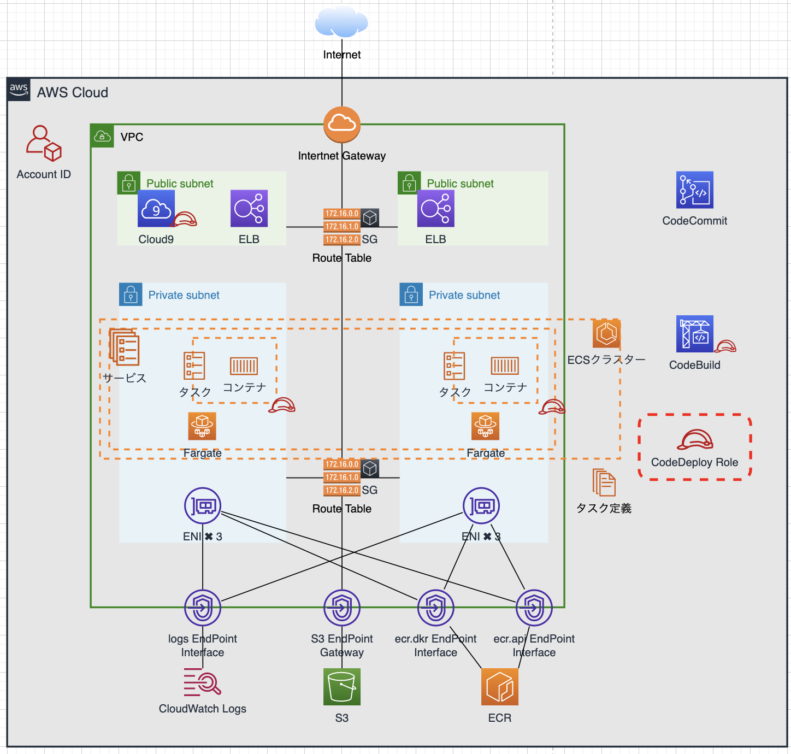
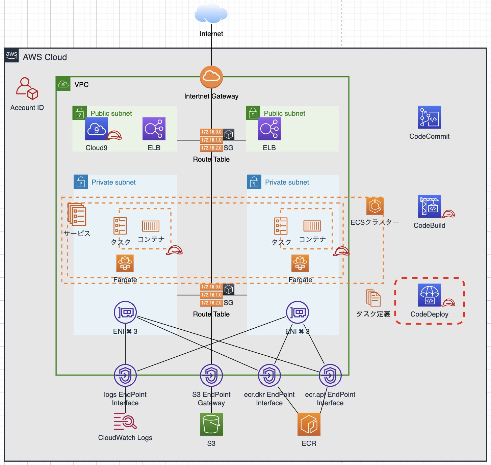

### ■CodeDeploy用Role作成



#### cmd

```Cloud9
cd ~/environment
cat << EOF > assume-role-policy-document.json
{
  "Version": "2012-10-17",
  "Statement": [
    {
      "Sid": "",
      "Effect": "Allow",
      "Principal": {
        "Service": "codedeploy.amazonaws.com"
      },
      "Action": "sts:AssumeRole"
    }
  ]
}
EOF
```

```Cloud9
aws iam create-role \
  --role-name ContainerHandsOnForCodeDeploy \
  --assume-role-policy-document file://assume-role-policy-document.json
```

#### result

```Cloud9
{
    "Role": {
        "Path": "/",
        "RoleName": "ContainerHandsOnForCodeDeploy",
        "RoleId": "AROASHENIAIFBSQTXUQW5",
        "Arn": "arn:aws:iam::123456789012:role/ContainerHandsOnForCodeDeploy",
        "CreateDate": "2022-09-15T12:18:50Z",
        "AssumeRolePolicyDocument": {
            "Version": "2012-10-17",
            "Statement": [
                {
                    "Sid": "",
                    "Effect": "Allow",
                    "Principal": {
                        "Service": "codedeploy.amazonaws.com"
                    },
                    "Action": "sts:AssumeRole"
                }
            ]
        }
    }
}
```

### ■CodeDeploy用RoleにPolicyをアタッチ

#### cmd

```
aws iam attach-role-policy \
  --role-name ContainerHandsOnForCodeDeploy \
  --policy-arn arn:aws:iam::aws:policy/AWSCodeDeployRoleForECS
```

#### result

```
（なし）
```

#### cmd

```
aws iam attach-role-policy \
  --role-name ContainerHandsOnForCodeDeploy \
  --policy-arn arn:aws:iam::aws:policy/AmazonEC2ContainerRegistryPowerUser
```

#### result

```
（なし）
```

#### cmd

```
aws iam list-attached-role-policies \
  --role-name ContainerHandsOnForCodeDeploy
```

#### result

```Cloud9
{
    "AttachedPolicies": [
        {
            "PolicyName": "AmazonEC2ContainerRegistryPowerUser",
            "PolicyArn": "arn:aws:iam::aws:policy/AmazonEC2ContainerRegistryPowerUser"
        },
        {
            "PolicyName": "AWSCodeDeployRoleForECS",
            "PolicyArn": "arn:aws:iam::aws:policy/AWSCodeDeployRoleForECS"
        }
    ]
}
```

### ■アプリケーションを作成

- デプロイするアプリケーションを識別する名前を定義します。



#### cmd

```Cloud9
aws deploy create-application \
  --application-name ContainerHandsOn \
  --compute-platform ECS \
  --tags Key=Name,Value=ContainerHandsOn
```

#### result

```Cloud9
{
    "applicationId": "600579a4-9101-4a98-8915-7fab2fed747a"
}
```

### ■ターゲットグループの作成

- ALBのターゲットグループを新規作成します。テスト用として、通常利用とは異なるポート番号を指定します。

#### cmd

```Cloud9
aws elbv2 create-target-group \
    --name ContainerHandsOn8080 \
    --protocol HTTP \
    --port 8080 \
    --target-type ip \
    --health-check-protocol HTTP \
    --health-check-port traffic-port \
    --health-check-path /index.php \
    --vpc-id ${VpcId}
```

#### result

```Cloud9
{
    "TargetGroups": [
        {
            "TargetGroupArn": "arn:aws:elasticloadbalancing:ap-northeast-1:123456789012:targetgroup/ContainerHandsOn8080/71b573e9a3227e50",
            "TargetGroupName": "ContainerHandsOn8080",
            "Protocol": "HTTP",
            "Port": 8080,
            "VpcId": "vpc-010a940bbd8f747c2",
            "HealthCheckProtocol": "HTTP",
            "HealthCheckPort": "traffic-port",
            "HealthCheckEnabled": true,
            "HealthCheckIntervalSeconds": 30,
            "HealthCheckTimeoutSeconds": 5,
            "HealthyThresholdCount": 5,
            "UnhealthyThresholdCount": 2,
            "HealthCheckPath": "/index.php",
            "Matcher": {
                "HttpCode": "200"
            },
            "TargetType": "ip",
            "ProtocolVersion": "HTTP1",
            "IpAddressType": "ipv4"
        }
    ]
}
```

### ■ターゲットグループのARN取得

- 上記で作成したターゲットグループのARNを取得します

#### cmd

```Cloud9
TargetGroupArn8080=`aws elbv2 describe-target-groups \
  --names ContainerHandsOn8080 \
  --query "TargetGroups[*].TargetGroupArn" \
  --output text`
```

```Cloud9
clear; cat << EOF
AccountID : ${AccountID}
VpcId : ${VpcId}
SubnetId1aPublic : ${SubnetId1aPublic}
SubnetId1cPublic : ${SubnetId1cPublic}
SubnetId1aPrivate : ${SubnetId1aPrivate}
SubnetId1cPrivate : ${SubnetId1cPrivate}
InternetGatewayId : ${InternetGatewayId}
RouteTableIdPublic : ${RouteTableIdPublic}
RouteTableIdPrivate : ${RouteTableIdPrivate}
PublicSecurityGroupsId : ${PublicSecurityGroupsId}
PrivateSecurityGroupsId : ${PrivateSecurityGroupsId}
InstanceId : ${InstanceId}
LoadBalancersDnsName : ${LoadBalancersDnsName}
LoadBalancerArn : ${LoadBalancerArn}
TargetGroupArn : ${TargetGroupArn}
RevisionNo : ${RevisionNo}
TargetGroupArn8080 : ${TargetGroupArn8080}
EOF
```

#### result

```Cloud9
AccountID : 123456789012
VpcId : vpc-010a940bbd8f747c2
SubnetId1aPublic : subnet-0356b36ba2daa766c
SubnetId1cPublic : subnet-0dabe411bfdc835fb
SubnetId1aPrivate : subnet-0d99180ac3baeb5fa
SubnetId1cPrivate : subnet-0a66f1c2d5ce3b939
InternetGatewayId : igw-082f42082d7748713
RouteTableIdPublic : rtb-000a11e6eacc5c263
RouteTableIdPrivate : rtb-077b87e7eb65d1f43
PublicSecurityGroupsId : sg-065a7c8eceb9759d4
PrivateSecurityGroupsId : sg-0f59547a1185820b5
InstanceId : i-0ddf413a91a008a52
LoadBalancersDnsName : ContainerHandsOn-681708310.ap-northeast-1.elb.amazonaws.com
LoadBalancerArn : arn:aws:elasticloadbalancing:ap-northeast-1:123456789012:loadbalancer/app/ContainerHandsOn/b392eaa096f09053
TargetGroupArn : arn:aws:elasticloadbalancing:ap-northeast-1:123456789012:targetgroup/ContainerHandsOn/b2da630c91ed7148
RevisionNo : 11
TargetGroupArn8080 : arn:aws:elasticloadbalancing:ap-northeast-1:123456789012:targetgroup/ContainerHandsOn8080/71b573e9a3227e50
```

### ■リスナーの作成

- ALBに対する接続リクエストを追加します。8080ポートでテスト用として受け口となるリスナーです。

#### cmd

```Cloud9
aws elbv2 create-listener \
    --load-balancer-arn ${LoadBalancerArn} \
    --protocol HTTP \
    --port 8080 \
    --default-actions Type=forward,TargetGroupArn=${TargetGroupArn8080}
```

#### result

```Cloud9
{
    "Listeners": [
        {
            "ListenerArn": "arn:aws:elasticloadbalancing:ap-northeast-1:123456789012:listener/app/ContainerHandsOn/b392eaa096f09053/b27b8d32f0e78f30",
            "LoadBalancerArn": "arn:aws:elasticloadbalancing:ap-northeast-1:123456789012:loadbalancer/app/ContainerHandsOn/b392eaa096f09053",
            "Port": 8080,
            "Protocol": "HTTP",
            "DefaultActions": [
                {
                    "Type": "forward",
                    "TargetGroupArn": "arn:aws:elasticloadbalancing:ap-northeast-1:123456789012:targetgroup/ContainerHandsOn8080/71b573e9a3227e50",
                    "ForwardConfig": {
                        "TargetGroups": [
                            {
                                "TargetGroupArn": "arn:aws:elasticloadbalancing:ap-northeast-1:123456789012:targetgroup/ContainerHandsOn8080/71b573e9a3227e50",
                                "Weight": 1
                            }
                        ],
                        "TargetGroupStickinessConfig": {
                            "Enabled": false
                        }
                    }
                }
            ]
        }
    ]
}
```

### ■リスナーのARN取得

- リスナーのARNを取得します

#### cmd

```Cloud9
ListenerArn=`aws elbv2 describe-listeners \
    --load-balancer-arn ${LoadBalancerArn} \
    --query "Listeners[*].[Port,ListenerArn]" \
    --output text | grep "^80\s" | cut -f 2`
```

#### result

```Cloud9
（なし）
```

#### cmd

```Cloud9
ListenerArn8080=`aws elbv2 describe-listeners \
    --load-balancer-arn ${LoadBalancerArn} \
    --query "Listeners[*].[Port,ListenerArn]" \
    --output text | grep "^8080" | cut -f 2`
```

#### result

```Cloud9
（なし）
```

#### cmd

```Cloud9
clear; cat << EOF
AccountID : ${AccountID}
VpcId : ${VpcId}
SubnetId1aPublic : ${SubnetId1aPublic}
SubnetId1cPublic : ${SubnetId1cPublic}
SubnetId1aPrivate : ${SubnetId1aPrivate}
SubnetId1cPrivate : ${SubnetId1cPrivate}
InternetGatewayId : ${InternetGatewayId}
RouteTableIdPublic : ${RouteTableIdPublic}
RouteTableIdPrivate : ${RouteTableIdPrivate}
PublicSecurityGroupsId : ${PublicSecurityGroupsId}
PrivateSecurityGroupsId : ${PrivateSecurityGroupsId}
InstanceId : ${InstanceId}
LoadBalancersDnsName : ${LoadBalancersDnsName}
LoadBalancerArn : ${LoadBalancerArn}
TargetGroupArn : ${TargetGroupArn}
RevisionNo : ${RevisionNo}
TargetGroupArn8080 : ${TargetGroupArn8080}
ListenerArn : ${ListenerArn}
ListenerArn8080 : ${ListenerArn8080}
EOF
```

#### result

```Cloud9
AccountID : 123456789012
VpcId : vpc-010a940bbd8f747c2
SubnetId1aPublic : subnet-0356b36ba2daa766c
SubnetId1cPublic : subnet-0dabe411bfdc835fb
SubnetId1aPrivate : subnet-0d99180ac3baeb5fa
SubnetId1cPrivate : subnet-0a66f1c2d5ce3b939
InternetGatewayId : igw-082f42082d7748713
RouteTableIdPublic : rtb-000a11e6eacc5c263
RouteTableIdPrivate : rtb-077b87e7eb65d1f43
PublicSecurityGroupsId : sg-065a7c8eceb9759d4
PrivateSecurityGroupsId : sg-0f59547a1185820b5
InstanceId : i-0ddf413a91a008a52
LoadBalancersDnsName : ContainerHandsOn-681708310.ap-northeast-1.elb.amazonaws.com
LoadBalancerArn : arn:aws:elasticloadbalancing:ap-northeast-1:123456789012:loadbalancer/app/ContainerHandsOn/b392eaa096f09053
TargetGroupArn : arn:aws:elasticloadbalancing:ap-northeast-1:123456789012:targetgroup/ContainerHandsOn/b2da630c91ed7148
RevisionNo : 11
TargetGroupArn8080 : arn:aws:elasticloadbalancing:ap-northeast-1:123456789012:targetgroup/ContainerHandsOn8080/71b573e9a3227e50
ListenerArn : arn:aws:elasticloadbalancing:ap-northeast-1:123456789012:listener/app/ContainerHandsOn/b392eaa096f09053/b5d7e272d5152d8d
ListenerArn8080 : arn:aws:elasticloadbalancing:ap-northeast-1:123456789012:listener/app/ContainerHandsOn/b392eaa096f09053/b27b8d32f0e78f30
```

### ■PublicSubnetのインバウンドルールを追加

- リスナーとして8080ポートを追加するので、セキュリティグループにも8080ポートを許可します

#### cmd

```Cloud9
aws ec2 authorize-security-group-ingress \
    --group-id ${PublicSecurityGroupsId} \
    --protocol tcp \
    --port 8080 \
    --cidr 0.0.0.0/0
```

#### result

```Cloud9
{
    "Return": true,
    "SecurityGroupRules": [
        {
            "SecurityGroupRuleId": "sgr-01d5cd037c7937b18",
            "GroupId": "sg-065a7c8eceb9759d4",
            "GroupOwnerId": "123456789012",
            "IsEgress": false,
            "IpProtocol": "tcp",
            "FromPort": 8080,
            "ToPort": 8080,
            "CidrIpv4": "0.0.0.0/0"
        }
    ]
}
```

### ■デプロイグループの作成

- デプロイ環境の定義を行います

#### cmd

```Cloud9
cd ~/environment
cat << EOF > create-deployment-group.json
{
    "applicationName": "ContainerHandsOn",
    "deploymentGroupName": "ContainerHandsOn",
    "deploymentConfigName": "CodeDeployDefault.ECSAllAtOnce",
    "serviceRoleArn": "arn:aws:iam::${AccountID}:role/ContainerHandsOnForCodeDeploy",
    "deploymentStyle": {
        "deploymentType": "BLUE_GREEN",
        "deploymentOption": "WITH_TRAFFIC_CONTROL"
    },
    "blueGreenDeploymentConfiguration": {
        "terminateBlueInstancesOnDeploymentSuccess": {
            "action": "TERMINATE",
            "terminationWaitTimeInMinutes": 60
        },
        "deploymentReadyOption": {
            "actionOnTimeout": "STOP_DEPLOYMENT",
            "waitTimeInMinutes": 60
        }
    },
    "loadBalancerInfo": {
        "targetGroupPairInfoList": [
            {
                "targetGroups": [
                    {
                        "name": "ContainerHandsOn"
                    },
                    {
                        "name": "ContainerHandsOn8080"
                    }
                ],
                "prodTrafficRoute": {
                    "listenerArns": [
                        "${ListenerArn}"
                    ]
                },
                "testTrafficRoute": {
                    "listenerArns": [
                        "${ListenerArn8080}"
                    ]
                }
            }
        ]
    },
    "ecsServices": [
        {
            "serviceName": "ContainerHandsOn",
            "clusterName": "ContainerHandsOn"
        }
    ]
}
EOF
```

```Cloud9
aws deploy create-deployment-group \
  --cli-input-json file://create-deployment-group.json
```

#### result

```Cloud9
{
    "deploymentGroupId": "78905a92-a80f-4ac5-8b0f-fcb52b042b58"
}
```